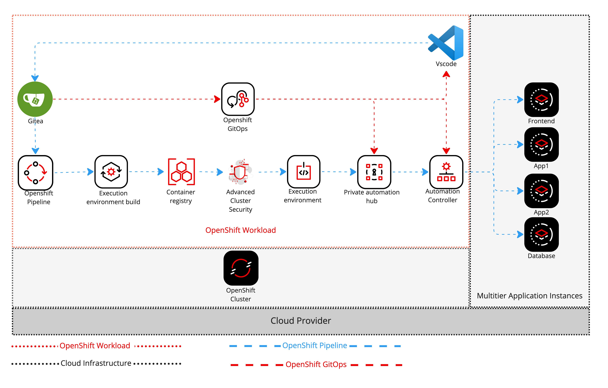

:numbered:
:imagedir: ./images

== Overview

.Architecture

=== Let’s understand this architecture a bit

The use of the Git Ops framework streamlines the process of creating and deploying custom execution environments (EEs) in the Red Hat Ansible Automation Platform. When an Automation Engineer updates the private Gitea repository with new requirements, the OpenShift Pipelines are triggered for Continuous Integration. This pipeline builds a new EE and pushes it to the container registry. The image is then scanned for security vulnerabilities by Advanced Cluster Security, and once it passes the scan, it is updated to the Private Automation Hub and then to the Automation Controller. This allows for a streamlined and secure process for deploying new EEs to the Automation Controller, where they can be used to run jobs through the Job Templates. The use of OpenShift Git Ops allows for the management and deployment of the Ansible Automation Platform in a similar way to how other containerized applications are deployed through a continuous deployment process.
