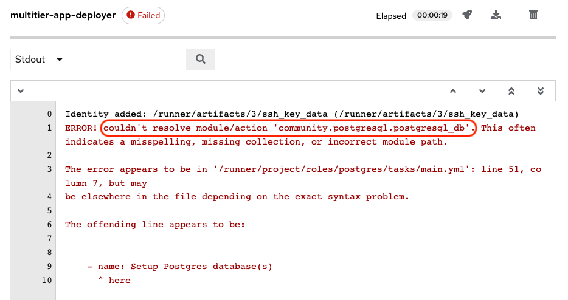
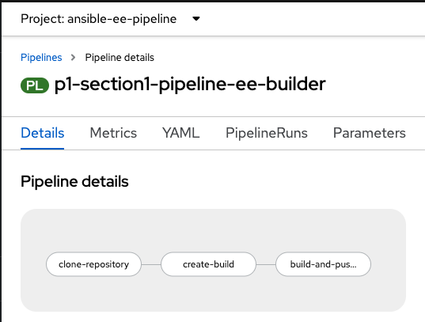

:numbered:

= Lab Section-1

In this section you have been contacted by the Ansible developer to investigate the root cause of the issue which results  in failure of Application deployment. The developer needs your expertise to resolve the issue. 

== Investigate the Issue

* Let’s start with observing the cause of failed job run.

. Login to Automation controller then navigate to Jobs and click on multitier-app-deployer failed job. Now observe the reason for job run failure.

+
.Login details-
[%autowidth.stretch,width=70%,cols="^.^a,^.^a",options="header"]
|====
| Elements | Value
| Controller URL | {AC_URL}
| Login user | {AC_USER}
| Password | {AC_PASSWORD}
|====
+
.Failed Job output

+
[NOTE] 
community.postgresql.postgresql_db module is used in the playbook shown in the error, which is missing in the default execution environment.

== Review the codebase

. Codebase
+
.Login details-
[%autowidth.stretch,width=70%,cols="^.^a,^.^a",options="header"]
|====
| Elements | Value
| Vscode URL | {VSCODE_URL}
| Password | {VSCODE_PASSWORD}
|====
+
image:./images/vscode.png[vscode,600]

== Resolution

As a Consultant you have investigated that community.postgresql collection is missing from the default EE used by the Job Template.

To resolve the issue you are going to build a custom EE which includes community.postgresql collection For automating the task to build a custom EEs you are utilizing openshift-pipeline (tekton). The tasks as part of the pipeline are triggered using a Webhook created on Gitea. The pipeline will be triggered only when a new tag and release  is created in the code base of EE. The EEs images will be tagged based on the tag name and pushed to Automation Hub. 

. Pipeline: Defines a series of Tasks that accomplish a specific build or delivery goal. Can be triggered by an event or invoked from a PipelineRun.
The pipeline has already been configured for this workshop.
+
.Login details-
[%autowidth.stretch,width=70%,cols="^.^a,^.^a",options="header"]
|====
| Elements | Value
| Console URL | link:{OC_CONSOLE_URL}/k8s/ns/ansible-ee-pipeline/tekton.dev\~v1beta1~Pipeline/p1-section1-pipeline-ee-builder[]
| Login user | {OC_USER}
| Password | {OC_PASSWORD}
|====
+
.Pipeline

. Tasks: Defines a series of steps which launch specific build or delivery tools that ingest specific inputs and produce specific outputs.

. Pipelinerun: Instantiates a Pipeline for execution with specific inputs, outputs, and execution parameters.

. Trigger - specifies what happens when the EventListener detects an event.

. EventListener - listens for events on Kubernetes cluster. Specifies one or more Triggers.

. Find event-listener's route for creating webhook.
 .. Go to networking -> route -> p1-section1-event-listener then copy Location url and keep it saved 

. Find event-listener's secret for creating webhook.
.. Go to workloads -> secrets -> click on p1-section1-trigger-secret, then copy secretToken and save it we will it when creating webhook.

