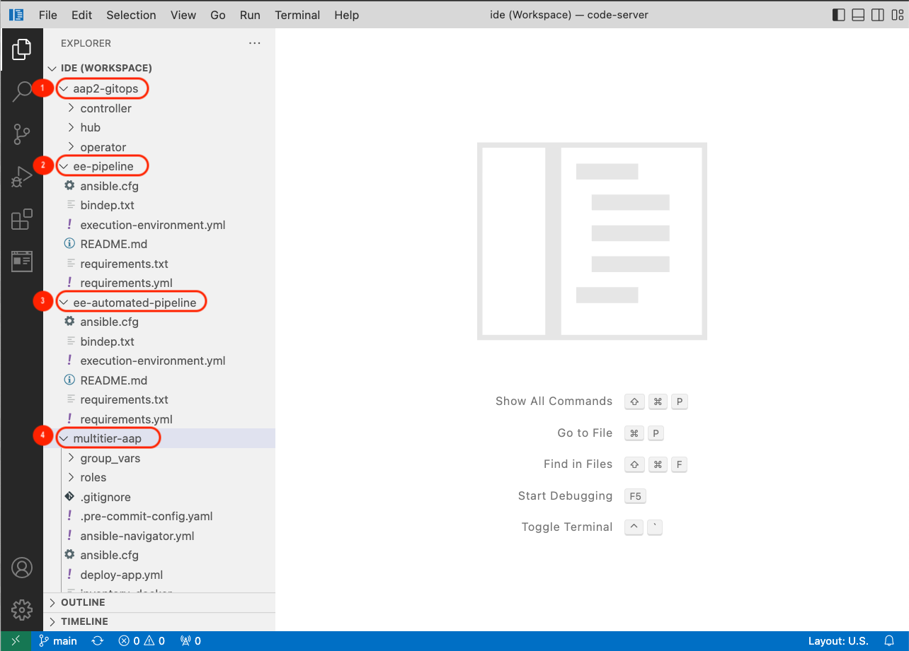
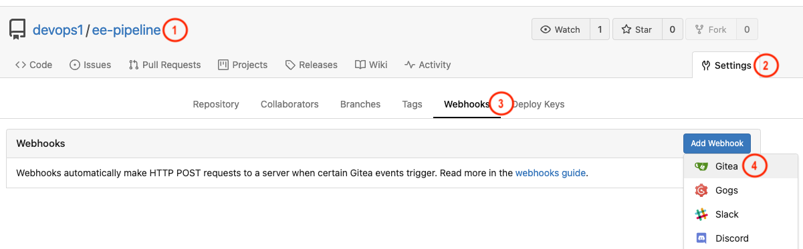
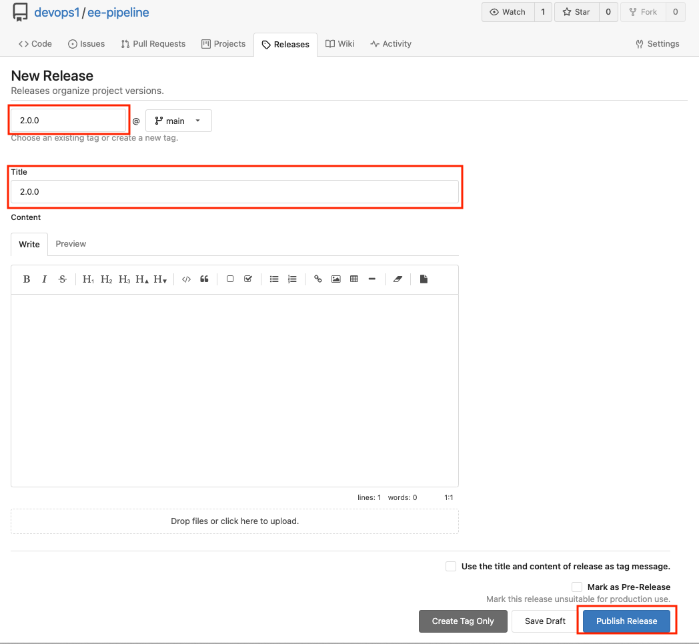
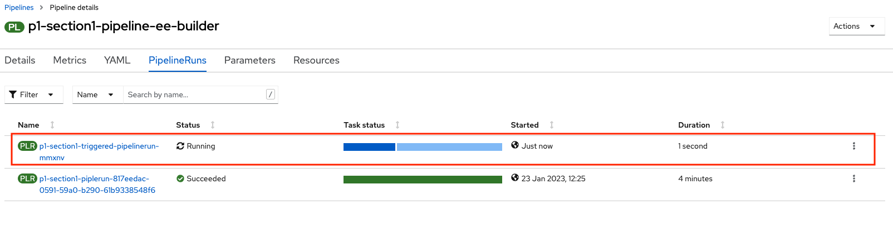
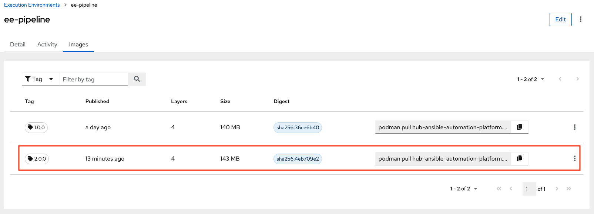
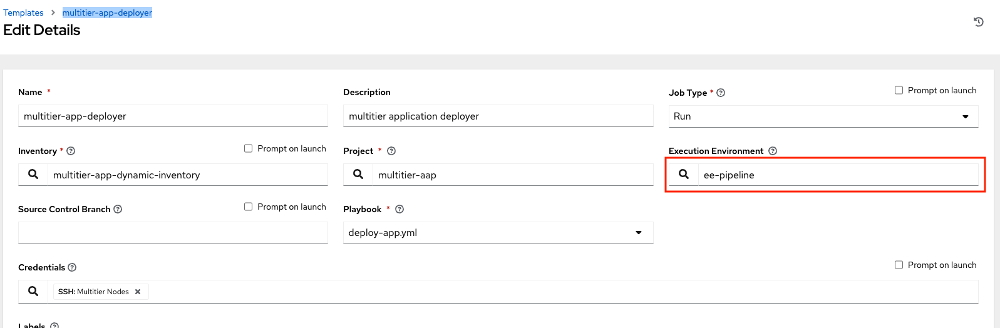

:numbered:
:GUID: %guid%
:BASE_DOMAIN: FINDME
:AC_URL: %ac_web_url%
:AC_USER: %ac_user%
:AC_PASSWORD: %ac_password%
:AH_URL: %ah_web_url%
:AH_USER: %ah_user%
:AH_PASSWORD: %ah_password%
:VSCODE_URL: %codeserver_url%
:VSCODE_PASSWORD: %codeserver_password%
:GITEA_URL: %gitea_console_url%
:GITEA_USER: %bastion_ssh_user_name%
:GITEA_PASSWORD: %bastion_ssh_password%
:OC_CONSOLE_URL: %openshift_console_url%
:OC_USER: %openshift_cluster_admin_username%
:OC_PASSWORD: %openshift_cluster_admin_password%
:BASTION_host: %bastion_public_hostname%
:BASTION_USER: %bastion_ssh_user_name%
:BASTION_PASSWORD: %bastion_ssh_password%

= Pipeline to Build execution environment

In this section, you will be working closely with the Ansible developer to troubleshoot and resolve an issue that is causing a failure in the deployment of the application. Using your expertise in the OpenShift Git Ops framework and the Automation Controller, you will investigate the root cause of the issue and implement a solution to ensure successful deployment in the future. The goal of this task is to quickly and efficiently identify and fix the problem, to minimize downtime and ensure the smooth operation of the application.

== Investigate the Issue

* Let’s start with investigating the cause of failed job run.

. Login to Automation controller then navigate to Jobs and click on multitier-app-deployer failed job. 

+
.Login details:
[%autowidth.stretch,width=70%,cols="^.^a,^.^a",options="header"]
|====
| Elements | Value
| Controller URL | {AC_URL}
| Login user | {AC_USER}
| Password | {AC_PASSWORD}
|====
+
.Failed Job output
image:./images/job_run_failed.png[job,600]

+
[NOTE] 
community.postgresql.postgresql_db module is used in the playbook shown in the error, which is missing in the default execution environment.

== Review the codebase
. Codebase
+
.Login details:
[%autowidth.stretch,width=70%,cols="^.^a,^.^a",options="header"]
|====
| Elements | Value
| Vscode URL | {VSCODE_URL}
| Password | {VSCODE_PASSWORD}
|====
+

+
* *aap2-gitops*: Yaml manifests to install AAP2 on Openshift using openshift-gitops(ArgoCD).

* *ee-pipeline*: Repository containing configuration files for buildah to build EEs for Section 1 of the workshop.
* *ee-automated-pipeline*: Repository containing configuration files for buildah to build EEs for Section 2 of the workshop.
* *multitier-aap*: Repository for Ansible Content to deploy Multi-tier applications. 

== Resolution

As a Consultant you have investigated that community.postgresql collection is missing from the default EE used by the Job Template.

To resolve the issue you are going to build a custom EE which includes community.postgresql collection. For automating the task to build a custom EEs you are utilizing openshift-pipeline (tekton). 

The *tasks* as part of the pipeline are triggered using a Webhook created on Gitea. The *pipeline* will be triggered only when a new tag and release  is created in the code base of EE. The EEs images will be tagged based on the tag name and pushed to *Private Automation Hub*. 

. *Pipeline:* Defines a series of Tasks that accomplish a specific build or delivery goal. Can be triggered by an event or invoked from a PipelineRun.
The pipeline has already been configured for this workshop.

+
.Login details:
[%autowidth.stretch,width=70%,cols="^.^a,^.^a",options="header"]
|====
| Elements | Value
| Console URL | link:{OC_CONSOLE_URL}/k8s/ns/ansible-ee-pipeline/tekton.dev\~v1beta1~Pipeline/p1-section1-pipeline-ee-builder[]
| Login user | {OC_USER}
| Password | {OC_PASSWORD}
|====
+
.Pipeline
image:./images/pipeline-1.png[p1,600]
+
* *Tasks:* Defines a series of steps which launch specific build or delivery tools that ingest specific inputs and produce specific outputs.

* *Pipelinerun:* Instantiates a Pipeline for execution with specific inputs, outputs, and execution parameters.

* *Trigger:* specifies what happens when the EventListener detects an event.

* *EventListener:* listens for events on Kubernetes cluster. Specifies one or more Triggers.

. Find event-listener's route for creating webhook.
 .. Go to networking -> route -> p1-section1-event-listener then copy Location url and keep it saved 

. Find event-listener's secret for creating webhook.
.. Go to workloads -> secrets -> click on p1-section1-trigger-secret, then copy secretToken and save it we will it when creating webhook.

. Login to Gitea and configure webhook for the *ee-pipeline* repository.
+
.Login details:
[%autowidth.stretch,width=70%,cols="^.^a,^.^a",options="header"]
|====
| Elements | Value
| Gitea URL | {GITEA_URL}
| Login user | {GITEA_USER}
| Password | {GITEA_PASSWORD}
|====

. Click ee-pipeline repository --> settings --> webhook --> Click Add Webhook --> select Gitea

+
.Gitea webhook:

. Fill the webhook form as follows:
.. Copy event listner route in *Target URL*
.. Copy event listener secret in *Secret*
.. Select Custom Events
.. Select Release
.. Click on the Add Webhook button to create webhook.

+
.Gitea webhook page:
image:./images/gitea_webhook_2.png[webhook2,600]

. Login to vscode to update the execution environment codebase.
+
.Login details:
[%autowidth.stretch,width=70%,cols="^.^a,^.^a",options="header"]
|====
| Elements | Value
| Vscode URL | {VSCODE_URL}
| Password | {VSCODE_PASSWORD}
|====

. Expand ee-pipeline codebase directory and update following collection in the requirements.yml file.

+
[source,text]
----
  - name: community.postgresql
    version: 2.3.2
----
+
.Add collection
image:./images/vscode_req_1.png[req1,600]

+
NOTE: https://access.redhat.com/documentation/en-us/red_hat_ansible_automation_platform/2.0-ea/html-single/ansible_builder_guide/index#con-building-definition-file

. Commit and push the changes to git as shown in the picture.
+
.Commit and Push
image:./images/vscode_req_2.png[req2,600]

+
.Confirm
image:./images/vscode_req_3.png[req3,600]

. You are ready to run pipeline to build execution environment.
.. Go to gitea and create new release *2.0.0* which will trigger pipeline using webhook created in the previous steps.
+
.Release 2.0.0
+
image:./images/release_1.png[release,600]

+
.Publish

. Observe that pipeline has triggered to build the EE and push to Private automation hub.
+
.Login details:
[%autowidth.stretch,width=70%,cols="^.^a,^.^a",options="header"]
|====
| Elements | Value
| Console URL | link:{OC_CONSOLE_URL}/k8s/ns/ansible-ee-pipeline/tekton.dev\~v1beta1~Pipeline/p1-section1-pipeline-ee-builder[]
| Login user | {OC_USER}
| Password | {OC_PASSWORD}
|====

. After login click pipelineRuns tab to check.
+
.PipelineRun

. Login to Private Automation Hub to check new EE ee-pipeline is created. 
+
.Login details:
[%autowidth.stretch,width=70%,cols="^.^a,^.^a",options="header"]
|====
| Elements | Value
| Hub URL | {AH_URL}
| Login user | {AH_USER}
| Password | {AH_PASSWORD}
|====

. Click *Execution Environment* --> *ee-pipeline* --> *images*
+
.Image Tag

. Login to Automation Controller. Add execution environment and update job template.

+
.Login details:
[%autowidth.stretch,width=70%,cols="^.^a,^.^a",options="header"]
|====
| Elements | Value
| Controller URL | {AC_URL}
| Login user | {AC_USER}
| Password | {AC_PASSWORD}
|====

. Click on *Execution Environment* then click on *Add* to add new EE as follows.
+
.EE details:
[%autowidth.stretch,width=70%,cols="^.^a,^.^a"]
|===
| Name |  ee-pipeline
| Image |  hub-ansible-automation-platform.apps.cluster-{GUID}.{BASE_DOMAIN}/ee-pipeline:2.0.0
| Pull | Only pull the image if not present before running.
| Registry credential | hub_registry_credentials
|===

+
.Execution Environment
image:./images/ee_build_2.png[ee,600]

. Update EE in *multitier-app-deployer* job template.
+

. Verify the application has deployed using the following link.
+
.EE details:
[%autowidth.stretch,width=70%,cols="^.^a,^.^a"]
|===
| Application URL | link:http://frontend.{GUID}.{BASE_DOMAIN}[]
|===
+
.Web Application
image:./images/frontend.png[frontend,600]

== Clean up

Before you move to the next lab. Please run following clean job templates.

. Login to Automation Controller and Run the *multitier-app-teardown* job template to cleanup. 
+
.Login details:
[%autowidth.stretch,width=70%,cols="^.^a,^.^a",options="header"]
|====
| Elements | Value
| Controller URL | {AC_URL}
| Login user | {AC_USER}
| Password | {AC_PASSWORD}
|====
