:numbered:
:GUID: %guid%
:BASE_DOMAIN: %base_domain%
:AC_URL: %ac_web_url%
:AC_USER: %ac_user%
:AC_PASSWORD: %ac_password%
:AH_URL: %ah_web_url%
:AH_USER: %ah_user%
:AH_PASSWORD: %ah_password%
:VSCODE_URL: %codeserver_url%
:VSCODE_PASSWORD: %codeserver_password%
:GITEA_URL: %gitea_console_url%
:GITEA_USER: devops1
:GITEA_PASSWORD: %codeserver_password%
:OC_CONSOLE_URL: %openshift_console_url%
:OC_USER: %openshift_cluster_admin_username%
:OC_PASSWORD: %openshift_cluster_admin_password%
:BASTION_HOST: %bastion_public_hostname%
:BASTION_USER: %bastion_ssh_user_name%
:BASTION_PASSWORD: %bastion_ssh_password%

== Pipeline to Build Execution Environment

In this section, you will be working closely with an Ansible developer to troubleshoot and resolve an issue that is causing a failure in the deployment of the application. 
Using your expertise in OpenShift and Ansible Automation Platform, you will investigate the issue and identify the root cause. 
You will then implement a solution to ensure successful deployments in the future. 

The goal of this task is to quickly and efficiently identify and fix the problem, minimize downtime, and ensure the smooth deployment and operation of the application.

== Investigate the Issue

* Let’s start by investigating the cause of failed job run.

. Login to your Automation controller
+
.Login details:
[%autowidth.stretch,width=70%,cols="^.^a,^.^a",options="header"]
|====
| Elements | Value
| Controller URL | {AC_URL}
| Login user | {AC_USER}
| Password | {AC_PASSWORD}
|====
+

. Navigate to the *Templates* Screen and chose the failing *Job Template* `multitier-app-deployer`
+

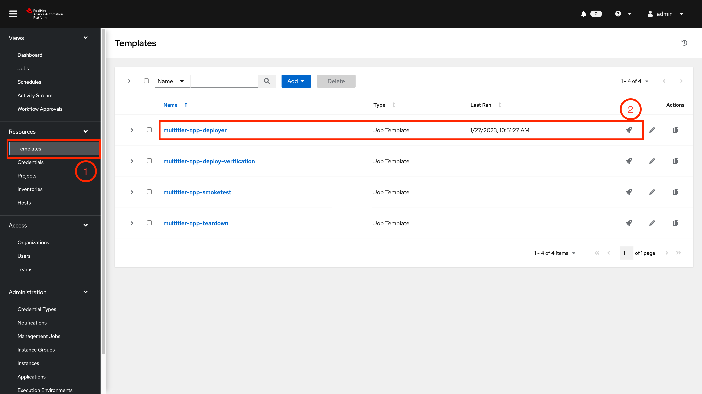
+

. Launch the top Template `multitier-app-deployer` via the Rocket Icon 
+

. You will be taken to the *Output* screen where, after a short delay, as the Project Syncs and the Execution Environment starts, you will see a failure very early in the process 
+

.Failed Job output
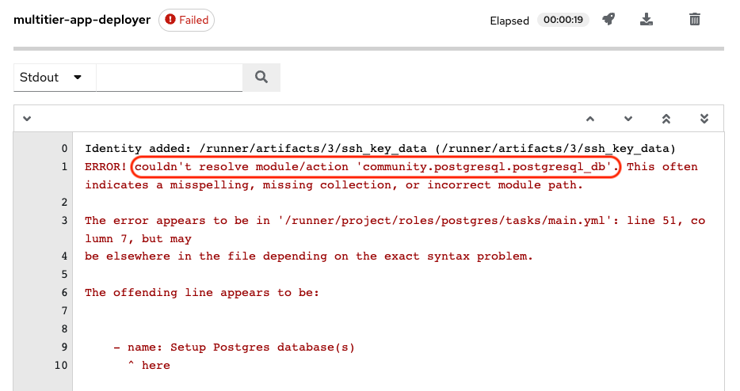
+

[NOTE] 
The `community.postgresql.postgresql_db`` module is used in the playbook shown in the error, which is missing in the default execution environment.

There are 2 ways that a missing collection error like this can be resolved. Both involve adding the dependency to a `requirements.yml` file in 1 of 2 locations.

* Add it to the playbook repository itself, and the Execution Environment will dynamically download it at runtime
** This is, arguably, an easy but inefficient fix, which will download it every single Job run
** It introduces an external dependency where an outage could cause job failure
* Add the dependency to the Execution Environment build repository

Wanting a more permanent fix, avoiding dynamic downloads we will choose the latter.

[NOTE]
In the development stage it is quite common to add collections in the deployer repos `requirements.yml` and additionally this can be used to extend an existing EE.
There is a strong argument to be made that these should either come from a known good source such as Ansible Galaxy or be brought "behind the firewall" and hosted internally. EG Private Automation Hub and/or internal Git Repos.

== Review the codebase
. Codebase
+
.Login details:
[%autowidth.stretch,width=70%,cols="^.^a,^.^a",options="header"]
|====
| Elements | Value
| Vscode URL | {VSCODE_URL}
| Password | {VSCODE_PASSWORD}
|====
+
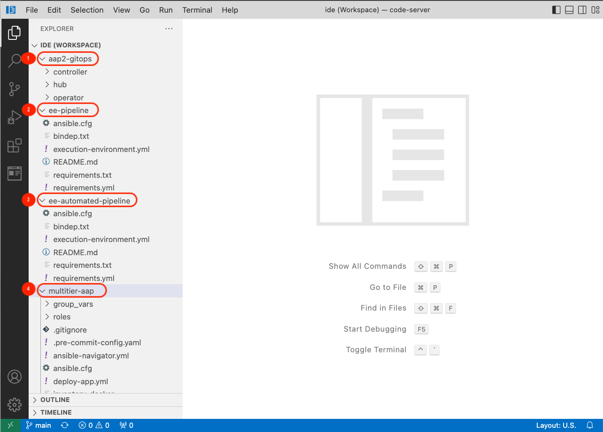
+
* *aap2-gitops*: Yaml manifests to install AAP2 on Openshift using openshift-gitops(ArgoCD).

* *ee-pipeline*: Repository containing configuration files for `buildah` to build EEs for Section 1 of the workshop.
* *ee-automated-pipeline*: Repository containing configuration files for `buildah` to build EEs for Section 2 of the workshop.
* *multitier-aap*: Repository for Ansible Content to deploy Multi-tier applications. 

== Resolution

As a Consultant, you have identified an issue with the Job Template in your workshop environment.
The *community.postgresql* collection is missing from the default *Execution Environment* (EE) being used by the Job Template. 
To resolve this issue, you will be building a custom EE that includes the community.postgresql collection.

To automate this task, you will be using the *OpenShift Pipelines (Tekton)* framework. The pipeline will be triggered automatically by a webhook that you have set up on Gitea. 
When a new tag and release are created in the code base of the EE, the pipeline will start running and automatically build the new custom EE.
The new EE images will be tagged with the same name and pushed to the *Private Automation Hub*.

The *tasks* as part of the pipeline are triggered using a Webhook created on Gitea. 
The *pipeline* will be triggered only when a new tag and release are created in the code base of EE. 
The EEs images will be tagged based on the tag name and pushed to *Private Automation Hub*. 

. *Pipeline:* Defines a series of Tasks that accomplish a specific build or delivery goal.
Can be triggered by an event or invoked from a PipelineRun.
The pipeline has already been configured for this workshop.

+
.Login details:
[%autowidth.stretch,width=70%,cols="^.^a,^.^a",options="header"]
|====
| Elements | Value
| Console URL | link:{OC_CONSOLE_URL}/k8s/ns/ansible-ee-pipeline/tekton.dev\~v1beta1~Pipeline/p1-section1-pipeline-ee-builder[]
| Login user | {OC_USER}
| Password | {OC_PASSWORD}
|====
+
.Pipeline
image:./images/pipeline-1.png[p1,600]
+
* *Tasks:* Defines a series of steps that launch specific build or delivery tools that ingest specific inputs and produce specific outputs.

* *Pipelinerun:* Instantiates a Pipeline for execution with specific inputs, outputs, and execution parameters.

* *Trigger:* specifies what happens when the EventListener detects an event.

* *EventListener:* listens for events on the Kubernetes cluster. Specifies one or more Triggers.

. Find the event listener's route for creating a webhook.
 .. Go to networking -> route -> p1-section1-event-listener then copy the Location URL and keep it saved 

. Find the event listener's secret for creating a webhook.
.. Go to workloads -> secrets -> click on p1-section1-trigger-secret, then copy secretToken and save it we will it when creating a webhook.

. Login to Gitea and configure a webhook for the *ee-pipeline* repository.
+
.Login details:
[%autowidth.stretch,width=70%,cols="^.^a,^.^a",options="header"]
|====
| Elements | Value
| Gitea URL | {GITEA_URL}
| Login user | {GITEA_USER}
| Password | {GITEA_PASSWORD}
|====

. Click ee-pipeline repository --> settings --> webhook --> Click Add Webhook --> select Gitea

+
.Gitea webhook:
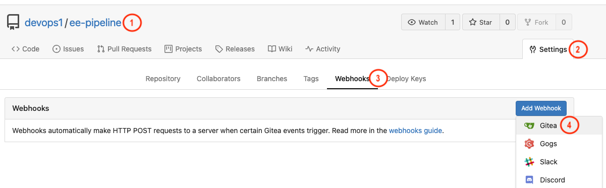

. Fill out the webhook form as follows:
.. Copy event listener route in *Target URL*
.. Copy event listener secret in *Secret*
.. Select Custom Events
.. Select Release
.. Click on the Add Webhook button to create the webhook.

+
.Gitea webhook page:
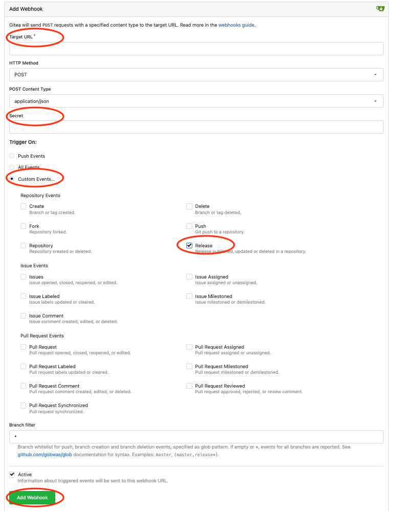

. Login to VSCode to update the execution environment codebase.
+
.Login details:
[%autowidth.stretch,width=70%,cols="^.^a,^.^a",options="header"]
|====
| Elements | Value
| Vscode URL | {VSCODE_URL}
| Password | {VSCODE_PASSWORD}
|====

. Expand the `ee-pipeline` codebase directory and update the following collection in the `requirements.yml` file.

+
[source,text]
----
  - name: community.postgresql
    version: 2.3.2
----
+
.Add collection
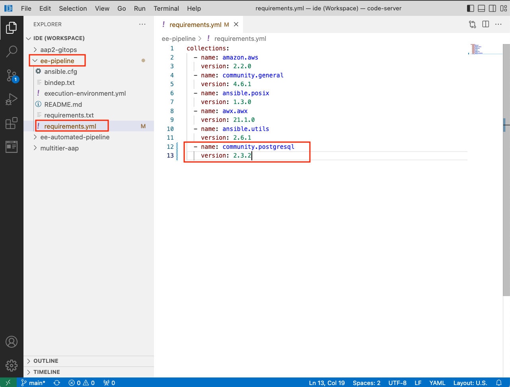

+
NOTE: https://access.redhat.com/documentation/en-us/red_hat_ansible_automation_platform/2.0-ea/html-single/ansible_builder_guide/index#con-building-definition-file

. Commit and push the changes to git as shown in the picture.
+
.Commit and Push
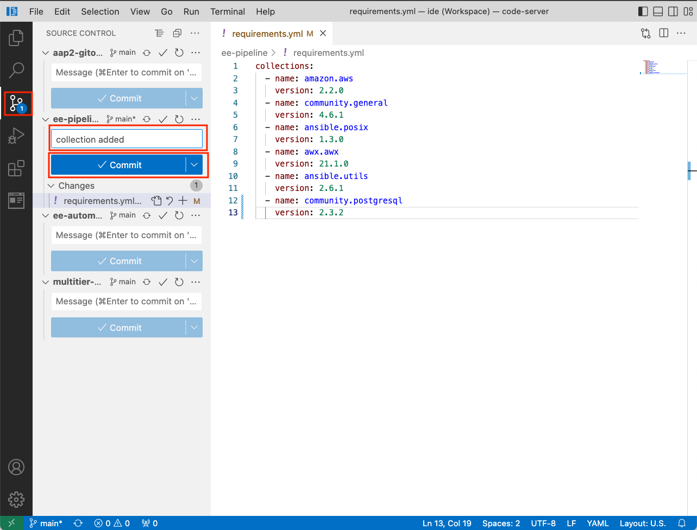

+
.Confirm
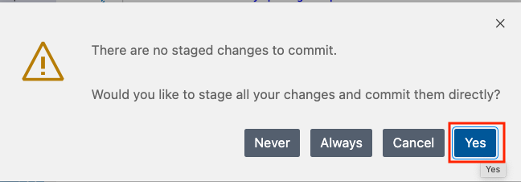

. You are ready to run the pipeline to build an Execution Environment.
.. Go to Gitea and create a new release *2.0.0* which will trigger the pipeline using the webhook created in the previous steps.
+
.Release 2.0.0
+
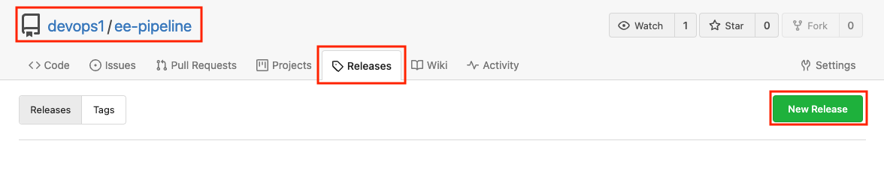

+
.Publish
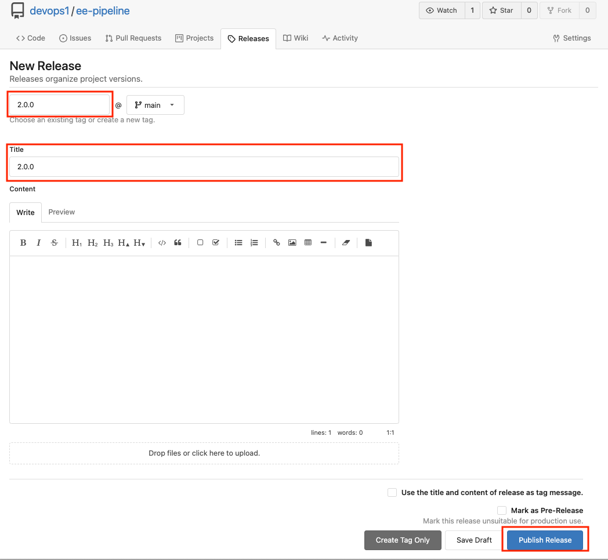

. Observe that the pipeline has triggered to build the EE and push to the Private Automation Hub.
+
.Login details:
[%autowidth.stretch,width=70%,cols="^.^a,^.^a",options="header"]
|====
| Elements | Value
| Console URL | link:{OC_CONSOLE_URL}/k8s/ns/ansible-ee-pipeline/tekton.dev\~v1beta1~Pipeline/p1-section1-pipeline-ee-builder[]
| Login user | {OC_USER}
| Password | {OC_PASSWORD}
|====

. After login click pipelineRuns tab to check.
+
.PipelineRun
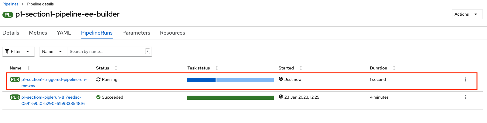

. Login to Private Automation Hub to check new EE ee-pipeline is created. 
+
.Login details:
[%autowidth.stretch,width=70%,cols="^.^a,^.^a",options="header"]
|====
| Elements | Value
| Hub URL | {AH_URL}
| Login user | {AH_USER}
| Password | {AH_PASSWORD}
|====

. Click *Execution Environment* --> *ee-pipeline* --> *images*
+
.Image Tag
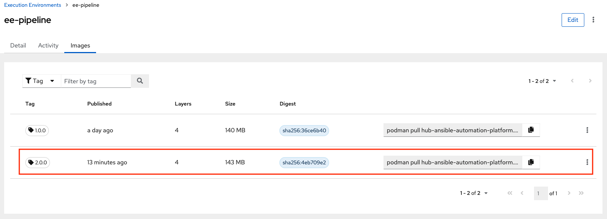

. Login to Automation Controller. Add execution environment and update job template.

+
.Login details:
[%autowidth.stretch,width=70%,cols="^.^a,^.^a",options="header"]
|====
| Elements | Value
| Controller URL | {AC_URL}
| Login user | {AC_USER}
| Password | {AC_PASSWORD}
|====

. Click on *Execution Environment* then click on *Add* to add new EE as follows.
+
.EE details:
[%autowidth.stretch,width=70%,cols="^.^a,^.^a"]
|===
| Name |  ee-pipeline
| Image |  hub-ansible-automation-platform.apps.cluster-{GUID}.{BASE_DOMAIN}/ee-pipeline:2.0.0
| Pull | Only pull the image if not present before running.
| Registry credential | hub_registry_credentials
|===

+
.Execution Environment
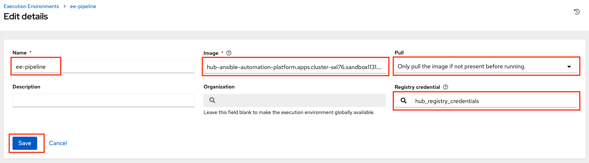

. Update the EE in *multitier-app-deployer* job template.
+
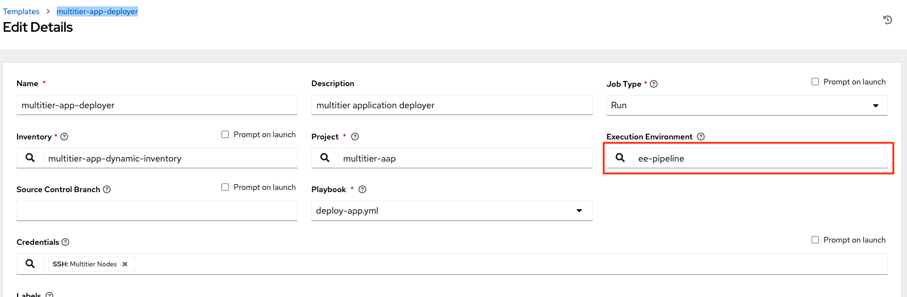

. Verify the application has been deployed using the following link.
+
.EE details:
[%autowidth.stretch,width=70%,cols="^.^a,^.^a"]
|===
| Application URL | link:http://frontend.{GUID}.{BASE_DOMAIN}[]
|===
+
.Web Application
image:./images/frontend.png[frontend,600]

== Clean up

Before you move to the next lab. Please run the following clean job templates.

. Login to Automation Controller and Run the *multitier-app-teardown* job template to cleanup. 
+
.Login details:
[%autowidth.stretch,width=70%,cols="^.^a,^.^a",options="header"]
|====
| Elements | Value
| Controller URL | {AC_URL}
| Login user | {AC_USER}
| Password | {AC_PASSWORD}
|====
