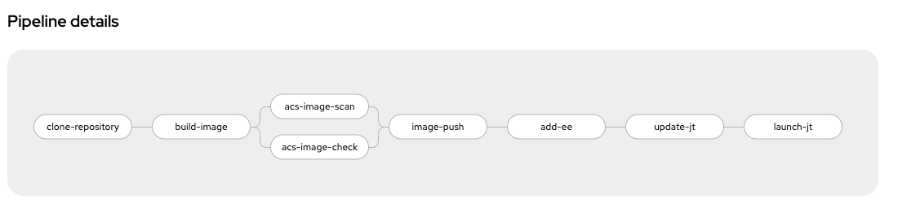

:numbered:
:GUID: %guid%
:BASE_DOMAIN: FINDME
:AC_URL: %ac_web_url%
:AC_USER: %ac_user%
:AC_PASSWORD: %ac_password%
:AH_URL: %ah_web_url%
:AH_USER: %ah_user%
:AH_PASSWORD: %ah_password%
:VSCODE_URL: %codeserver_url%
:VSCODE_PASSWORD: %codeserver_password%
:GITEA_URL: %gitea_console_url%
:GITEA_USER: %users.devops1.gitea_user%
:GITEA_PASSWORD: %users.devops1.gitea_password%
:OC_CONSOLE_URL: %openshift_console_url%
:OC_USER: %openshift_cluster_admin_username%
:OC_PASSWORD: %openshift_cluster_admin_password%
:BASTION_host: %bastion_public_hostname%
:BASTION_USER: %bastion_ssh_user_name%
:BASTION_PASSWORD: %bastion_ssh_password%

= Automated pipeline to build execution environment

In this section, we are showing you how to utilize the openshift-pipeline as the CI to fully automate the tasks from building EE to running the Job template and using the EE which was built as part of the same CI process. 

.Automated Pipeline

In this section, The pipeline includes additional tasks which use Red Hat Advance Cluster Security to scan and check for vulnerabilities in EE images.

*Image Scan:* will scan and report back the component with vulnerability found in the image being scanned.

*Image Check:* will check for build-time violations of your security policies in images

The pipeline also includes tasks which do API calls to update the Job template on Automation Controller with newly built custom EE and run the Job template as CI process. 

== Activity

. Login to vscode and update the execution environment codebase.
+
.Login details:
[%autowidth.stretch,width=70%,cols="^.^a,^.^a",options="header"]
|====
| Elements | Value
| Vscode URL | {VSCODE_URL}
| Password | {VSCODE_PASSWORD}
|====

. Expand *ee-automated-pipeline* codebase directory and update following collection in the *requirements.yml* file then commit and push the changes to git.

+
[source,text,width=600]
----
  - name: community.postgresql
    version: 2.3.2
----

. To trigger the pipeline, to build execution environment, Login to gitea and create new release *2.0.0* for *ee-automated-pipeline* repository. 
+
.Login details:
[%autowidth.stretch,width=70%,cols="^.^a,^.^a",options="header"]
|====
| Elements | Value
| Gitea URL | {GITEA_URL}
| Login user | {GITEA_USER}
| Password | {GITEA_PASSWORD}
|====
+
NOTE: Gitea webhook is already configured to trigger the pipeline.

== Verify

. Login to console and click *p2-section2-pipeline-ee-builder* pipeline then go to *PipelineRuns* tab and observe that pipeline has been triggered. 
+
.Login details:
[%autowidth.stretch,width=70%,cols="^.^a,^.^a",options="header"]
|====
| Elements | Value
| Console URL | link:{OC_CONSOLE_URL}/k8s/ns/ansible-ee-pipeline/tekton.dev\~v1beta1~Pipeline/p2-section2-pipeline-ee-builder[]
| Login user | {OC_USER}
| Password | {OC_PASSWORD}
|====

. Once pipeline is finished. Login to Private Automation Hub and check new EE ee-automated-pipeline is created. 

+
.Login details:
[%autowidth.stretch,width=70%,cols="^.^a,^.^a",options="header"]
|====
| Elements | Value
| Hub URL | {AH_URL}
| Login user | {AH_USER}
| Password | {AH_PASSWORD}
|====

. Login to Automation Controller:
.. Verify the new execution environment *ee-automated-pipeline* has been added.
.. Verify *multitier-app-deployer* job template has been update to use new *ee-automated-pipeline* EE.
.. Verify new job must have been run.
+
.Login details:
[%autowidth.stretch,width=70%,cols="^.^a,^.^a",options="header"]
|====
| Elements | Value
| Controller URL | {AC_URL}
| Login user | {AC_USER}
| Password | {AC_PASSWORD}
|====

. Verify the application has been deployed using the following link.
+
.EE details:
[%autowidth.stretch,width=70%,cols="^.^a,^.^a"]
|===
| Application URL | link:http://frontend.{GUID}.{BASE_DOMAIN}[]
|===
+
.Web Application
image:./images/frontend.png[frontend,600]