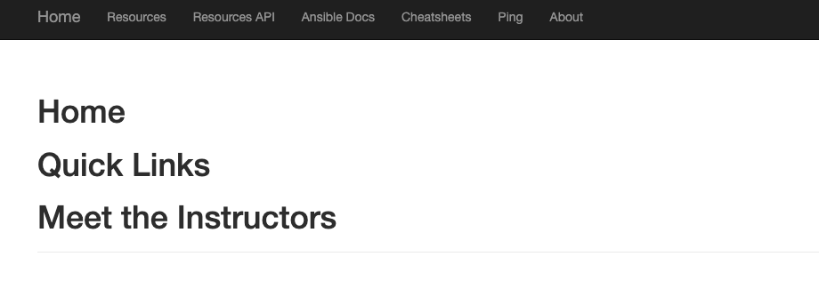

:numbered:
:GUID: %guid%
:BASE_DOMAIN: %ocp4_base_domain%
:AC_URL: %ac_web_url%
:AC_USER: %ac_user%
:AC_PASSWORD: %ac_password%
:AH_URL: %ah_web_url%
:AH_USER: %ah_user%
:AH_PASSWORD: %ah_password%
:VSCODE_URL: %codeserver_url%
:VSCODE_PASSWORD: %codeserver_password%
:GITEA_URL: %gitea_console_url%
:GITEA_USER: devops1
:GITEA_PASSWORD: %openshift_cluster_admin_password%
:OC_CONSOLE_URL: %openshift_console_url%
:OC_USER: %openshift_cluster_admin_username%
:OC_PASSWORD: %openshift_cluster_admin_password%
:BASTION_HOST: %bastion_public_hostname%
:BASTION_USER: %bastion_ssh_user_name%
:BASTION_PASSWORD: %bastion_ssh_password%

== Automated pipeline to build Execution Environment

This section will guide you through the process of customizing, creating, and pushing execution environments (EEs) to a central image registry using openshift-pipelines. By leveraging the Git Ops framework, we can ensure consistency and reproducibility throughout the automation process. We will demonstrate the steps involved in customizing EEs using a Gitea repository, creating EEs using openshift-pipelines, scanning EEs for security vulnerabilities, and pushing the images to the Private Automation Hub. Additionally, we will show how to use the custom EEs pushed to the registry to run job templates from the Automation Controller. 

By the end of this workshop, you will have a deeper understanding of how to fully automate the process of building and deploying EEs within the Ansible Automation Platform using OpenShift Git Ops.

.Automated Pipeline
image:./images/pipeline_2.png[pipeline,600]

In this section, we will demonstrate how to fully automate the process of building and deploying an execution environment (EE) using the OpenShift pipeline as the continuous integration (CI) tool. The pipeline includes tasks that utilize Red Hat's Advanced Cluster Security to scan and check for vulnerabilities in the EE images.

First, the pipeline will perform an Image Scan task which will scan the EE image and report back any components with vulnerabilities found.

Next, the pipeline will perform an Image Check task which will check the EE image for any build-time violations of security policies.

Once the EE image has passed the security checks, the pipeline will then use API calls to update the Job template on the Automation Controller with the newly built custom EE. The pipeline will then run the Job template as part of the CI process, ensuring that the EE is deployed and ready for use. Overall this process ensures the security and reliability of the deployed EE.

== Activity

. Login to vscode and update the execution environment codebase.
+
.Login details:
[%autowidth.stretch,width=70%,cols="^.^a,^.^a",options="header"]
|====
| Elements | Value
| Vscode URL | {VSCODE_URL}
| Password | {VSCODE_PASSWORD}
|====

. Expand *ee-automated-pipeline* codebase directory and update following collection in the *requirements.yml* file then commit and push the changes to git.

+
[source,text,width=600]
----
  - name: community.postgresql
    version: 2.3.2
----

. To trigger the pipeline, to build execution environment, Login to gitea and create new release *2.0.0* for *ee-automated-pipeline* repository. 
+
.Login details:
[%autowidth.stretch,width=70%,cols="^.^a,^.^a",options="header"]
|====
| Elements | Value
| Gitea URL | {GITEA_URL}
| Login user | {GITEA_USER}
| Password | {GITEA_PASSWORD}
|====
+
NOTE: Gitea webhook is already configured to trigger the pipeline.

== Verify

. Login to console and click *p2-section2-pipeline-ee-builder* pipeline then go to *PipelineRuns* tab and observe that pipeline has been triggered. 
+
.Login details:
[%autowidth.stretch,width=70%,cols="^.^a,^.^a",options="header"]
|====
| Elements | Value
| Console URL | link:{OC_CONSOLE_URL}/k8s/ns/ansible-ee-pipeline/tekton.dev\~v1beta1~Pipeline/p2-section2-pipeline-ee-builder[]
| Login user | {OC_USER}
| Password | {OC_PASSWORD}
|====

. Once pipeline is finished. Login to Private Automation Hub and check new EE ee-automated-pipeline is created. 

+
.Login details:
[%autowidth.stretch,width=70%,cols="^.^a,^.^a",options="header"]
|====
| Elements | Value
| Hub URL | {AH_URL}
| Login user | {AH_USER}
| Password | {AH_PASSWORD}
|====

. Login to Automation Controller:
.. Verify the new execution environment *ee-automated-pipeline* has been added.
.. Verify *multitier-app-deployer* job template has been update to use new *ee-automated-pipeline* EE.
.. Verify new job must have been run.
+
.Login details:
[%autowidth.stretch,width=70%,cols="^.^a,^.^a",options="header"]
|====
| Elements | Value
| Controller URL | {AC_URL}
| Login user | {AC_USER}
| Password | {AC_PASSWORD}
|====

. Verify the application has been deployed using the following link.
+
.EE details:
[%autowidth.stretch,width=70%,cols="^.^a,^.^a"]
|===
| Application URL | link:http://frontend.{GUID}.{BASE_DOMAIN}[]
|===
+
.Web Application

